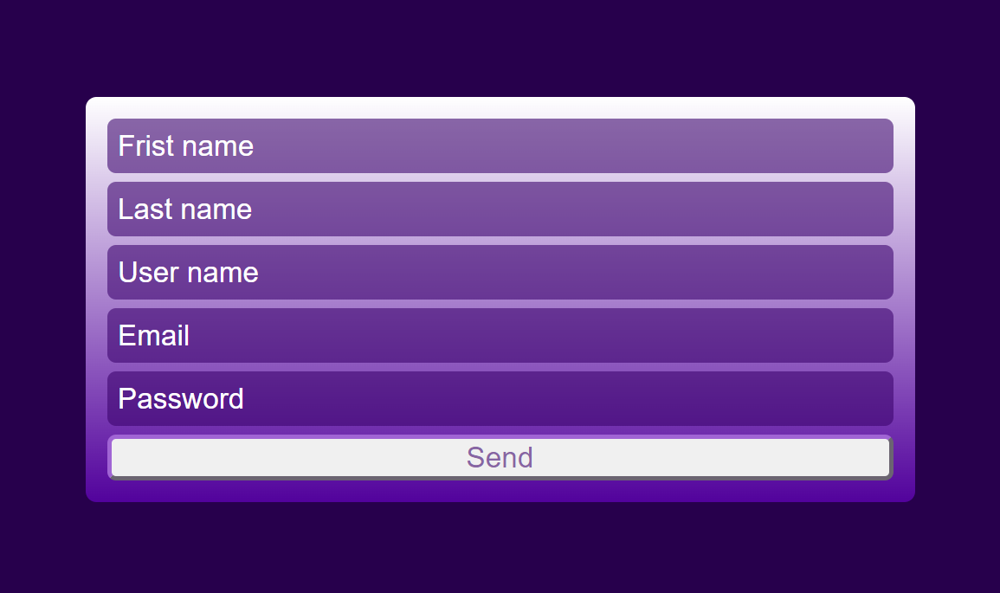

# 📋 Responsive Form

A responsive form built with pure HTML & CSS as part of my frontend learning journey.

---

## Demo 🎬

---
## 🔗 Live Demo
👉 [Click to Preview](https://github.com/SaraElbably-2024/responsive-form.git))

---

## ✨ Features
- Fully responsive using Flexbox
- Purple gradient background design
- Custom styled inputs and button
- Clean placeholder styling

---

## 🛠️ Built With
- HTML5
- CSS3
  - Flexbox (`flex-wrap`, `flex-grow`, `flex-basis`)
  - Gradient (`linear-gradient`)
  - Custom placeholder color (`::placeholder`)
  - Responsive layout without media queries

---

## 💡 What I Learned
- How to center elements using `justify-content` and `align-items`
- Difference between `justify` (horizontal) and `align` (vertical)
- Making a form responsive using `flex-wrap` and `min-width`
- Styling `::placeholder` with custom colors
 
 
